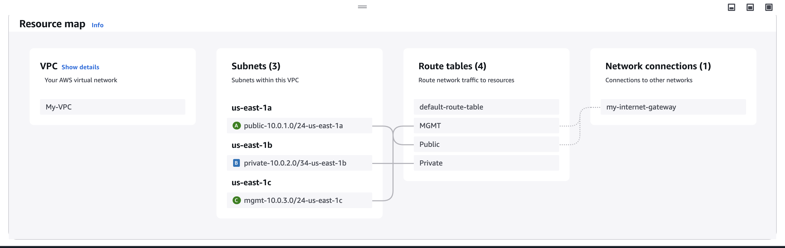

# AWS Study Project

This project is designed as a learning tool to explore and understand various AWS components and services.

## Purpose
The goal of this project is to study AWS subjects while implementing basic business rules. It will serve as a hands-on approach to understanding how different AWS services interact and function in a practical environment.

## Key Components
The project will involve AWS components like:

- **Application Load Balancer (ALB)**: Used for routing incoming traffic based on rules and distributing it to multiple targets.
- **Elastic Load Balancer (ELB)**: Provides automatic distribution of traffic across multiple resources.
- **Elastic Kubernetes Service (EKS)**: Facilitates the deployment, management, and scaling of containerized applications using Kubernetes.

Additional AWS services may be included as the project evolves.

## Scope
- Develop basic business rules to simulate real-world scenarios.
- Implement and configure the listed AWS components to achieve the project's goals.
- Gain familiarity with the practical aspects of AWS infrastructure and architecture.

### Network 

## Getting Started
1. Set up an AWS account.
2. Clone this repository.
3. Follow the configuration guides for each AWS component.

## Notes
- This project is intended solely for educational purposes.
- Ensure proper cost management and monitoring while using AWS services.

## License
This project is licensed under the MIT License - see the [LICENSE](LICENSE) file for details.
